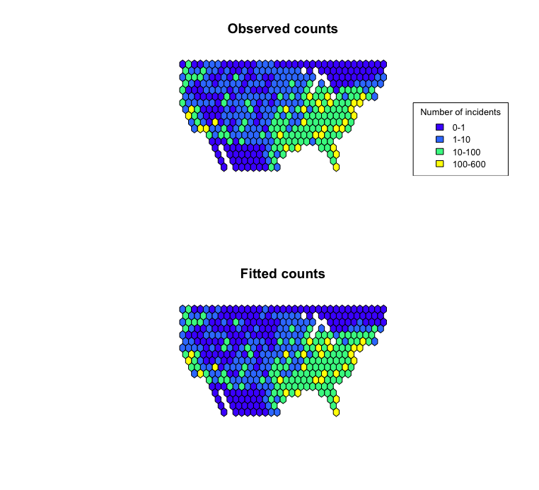
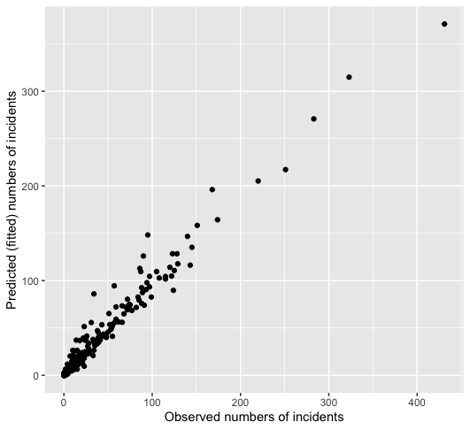
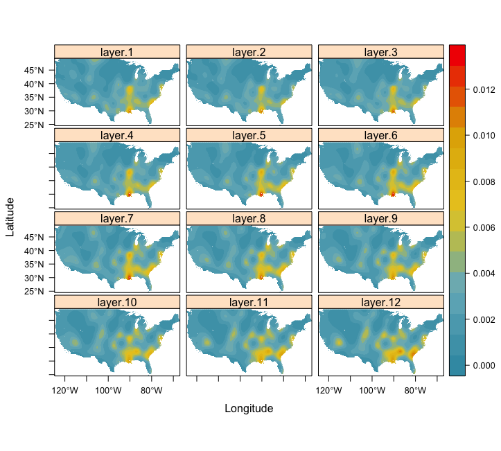
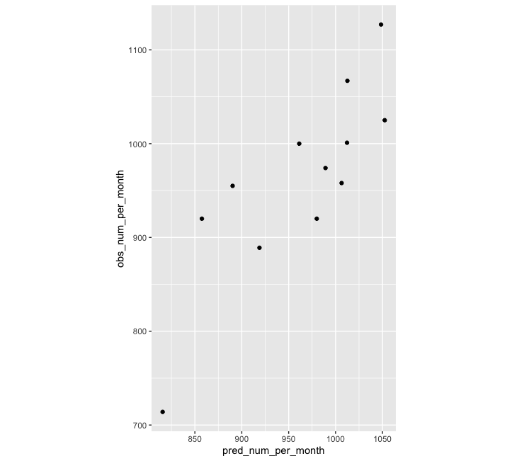

## Fitting point process models to disease case data with `mgcv` (or whatever you want)
We are going to fit a point process model using Generalized Additive Modeling via the `mgcv` package. 

First let's load the gun crime data for the USA in 2015 and corresponding population raster (WorldPop) from the [DiSARM package](https://github.com/disarm-platform/disarm-r-package)


```r
library(DiSARM)
library(raster)
library(mgcv)
library(wesanderson)
library(leaflet)
library(MapPalettes)
library(sf)
library(ggplot2)
data('gun_crime_USA_2015')
data('USA_pop_2015')
```

We can generate a map of these incidents
```r
quick_map(gun_crime_sf, 'num_killed')
```

<!-- -->

Now, to coin a phrase from Nick Golding's [ppmify](https://github.com/goldingn/ppmify) package, let's ppmify our data using `DiSARM::space_time_ppmify` to get it ready for modeling using Poisson regression. Here, we take a similar approach, however, instead of considering the point process as a continuous process, we aggregate points that occur in the same population (offset) cell and give them an appropriate regression weight and offset value. This minimizes the number of observations we have to include in the model (good for large datasets) and also makes some sense as the highest resolution we will (or maybe should) ever be able to predict is at the resolution of our population raster. 
```r
ppm_df <- DiSARM::space_time_ppmify(points = gun_crime_sf,
                exposure = USA_pop_2015,
                date_start_end=c("2015-01-01", "2015-12-31"),
                approx_num_int_points = 5000,
                prediction_stack=TRUE)
```

Now let's fit a model using `mgcv` using a spatial-only model
```r
gam_mod <- mgcv::gam(outcome ~ s(x, y, k=500),
               offset=log(exposure),
               weights = regression_weights,
               data = ppm_df$ppm_df,
               method = "REML",
               family = "poisson")
```

Predict 
```r
# Predict
predicted_log_rate <- predict(ppm_df$prediction_stack, gam_mod)
predicted_num <- exp(predicted_log_rate + log(USA_pop_2015))

# Check predicted numbers against observed
cellStats(predicted_num, sum)
nrow(gun_crime_sf)
```

    ## [1] 11434.85
    ## [1] 11550

Map predicted rate
```r
pred_raster_inc <- exp(predicted_log_rate)*1000
quick_map(pred_raster_inc, raster_legend_title="Gun crimes/1000")
```
<!-- -->

Using the [MapPalettes](https://github.com/disarm-platform/MapPalettes) package we can compare predicted versus observed counts using hexbins
```r
hexbin_stats <- MapPalettes::hexbin_raster(predicted_num, 500, function(x){sum(x,na.rm=T)})
intersects <- st_intersects(gun_crime_sf, st_as_sf(hexbin_stats))
intersects_table <- table(unlist(intersects))
hexbin_stats$observed <- 0
hexbin_stats$observed[as.numeric(names(intersects_table))] <- intersects_table

# And map
case_num_pal <- colorBin(topo.colors(5), c(0,600), bins = c(0, 1, 10, 100, 600))
par(mfrow=c(2,1))
plot(hexbin_stats, col = case_num_pal(hexbin_stats$observed), main = "Observed counts", asp=1)
legend("bottomright", inset=0, title="Number of incidents",
   c("0-1","1-10","10-100", "100-600"), fill=case_num_pal(c(0.5, 1.5, 10.5, 100.5)), horiz=FALSE, cex=0.8)
plot(hexbin_stats, col = case_num_pal(hexbin_stats$stat), main = "Fitted counts", asp=1)
```
<!-- -->

Now plot observed versus fitted
```r
ggplot() + geom_point(aes(hexbin_stats$observed, hexbin_stats$stat)) +
scale_x_continuous(name="Observed numbers of incidents") + 
  scale_y_continuous(name="Predicted (fitted) numbers of incidents")
```
<!-- -->


## Space-time example
Let's model the data across months. We can fit a spatio-temporal model using a tensor product between a bivariate spatial smooth and a smooth on time. We'll bump up the number of integration points as these will be spread across the time periods. 
```r
date_breaks <- seq(ymd("2015-01-01"), ymd("2016-01-01"), by = "month")
ppm_df_st <- space_time_ppmify(points = gun_crime_sf,
                exposure = USA_pop_2015,
                periods = date_breaks,
                approx_num_int_points = 25000,
                date_start_end=c("2015-01-01", "2015-12-31"),
                prediction_stack=TRUE)
```

Now let's fit a model using `mgcv`. We can make use of the `bam` function to speed things up slightly.
```r
gam_mod_st <- mgcv::bam(outcome ~ te(x, y, period, bs=c('tp', 'cr'), k=c(150,10),d=c(2,1)),
               offset=log(exposure),
               weights = regression_weights,
               data = ppm_df_st$ppm_df,
               method = "REML",
               family = "poisson")

```

Now we can predict for each month
```r
period_raster <- ppm_df$prediction_stack[[1]]
predicted_rate_stack <- stack()

# Loop through each time period and predict
for(i in 1:(length(date_breaks)-1)){
  period_raster[] <- i
  names(period_raster) <- 'period'
  pred_stack <- stack(ppm_df$prediction_stack[[c('x', 'y')]], period_raster)
  predicted_rate_stack <- stack(predicted_rate_stack,
                             predict(pred_stack, bam_mod_st))
}

# Plot
rasterVis::levelplot(exp(predicted_rate_stack)*1000, 
                par.settings = custom.theme(region = wes_palette(name= "Zissou1",n=32,"continuous")[1:32]))
```
<!-- -->


Check predicted number per time period
```r
pred_num_per_month <- cellStats(exp(predicted_rate_stack + log(USA_pop_2015)), sum)
obs_num_per_month <- table(cut.Date(gun_crime_sf$date, date_breaks))
ggplot() + geom_point(aes(pred_num_per_month, obs_num_per_month))
```
<!-- -->
